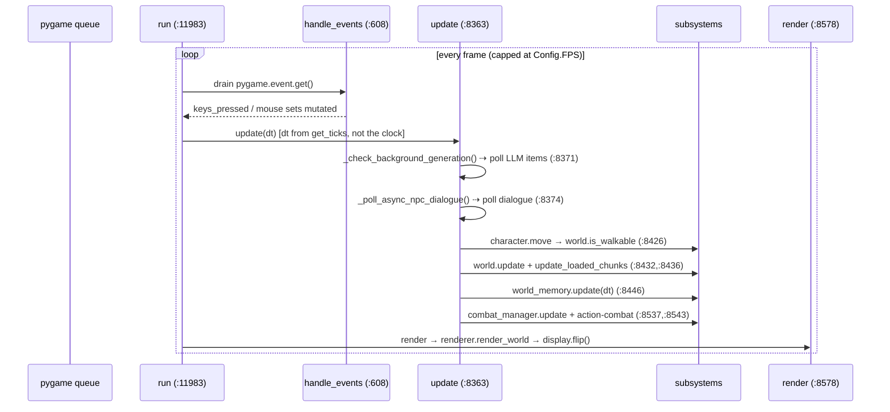
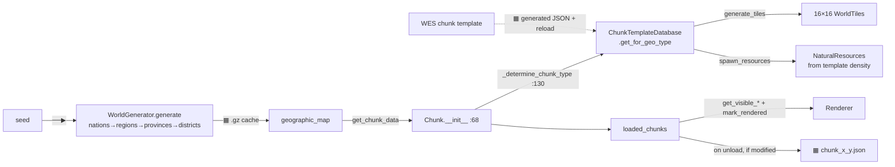
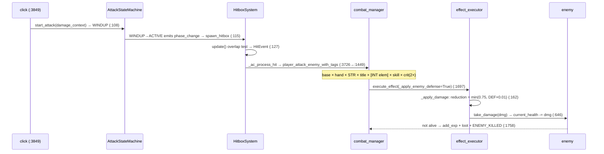
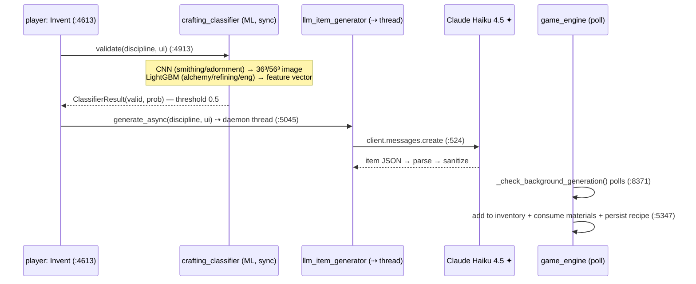
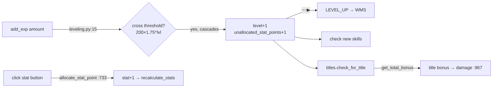
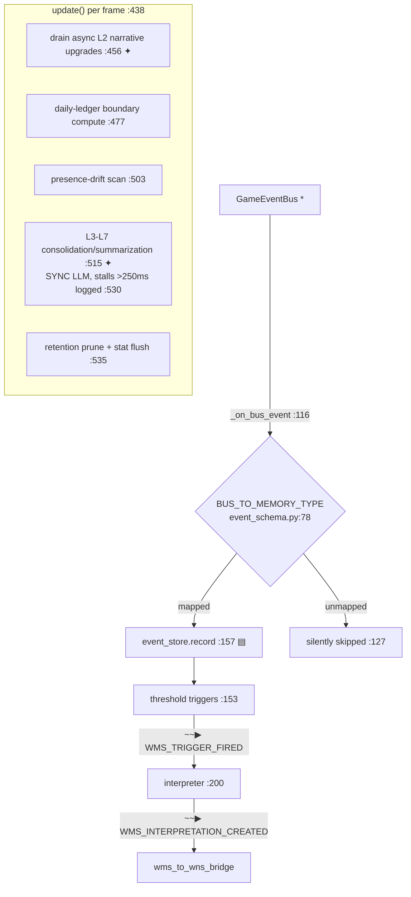
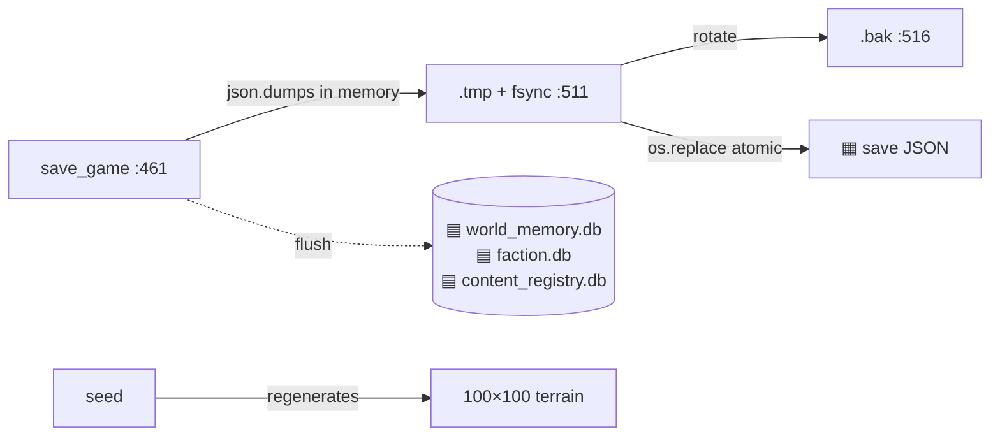

# Game‑1 — Game Systems Technical Brief

**The single authoritative reference for how Game‑1 works, end to end.**
Every workflow below is traced in *actual code* (not design docs) and every claim carries a
`file:line` anchor. Where code and documentation disagree, **the code is authoritative** and the
divergence is logged in [§16 Areas for Improvement](#16--areas-for-improvement-honest-state).

- **Scope:** the whole game — core loop, world, entities, combat, crafting, progression, the event
  backbone, the three‑part World System (WMS / WNS / WES), factions & NPCs, save/load, and the
  LLM/ML infrastructure.
- **Companion deck:** `GAME_SYSTEMS_BRIEF.html` presents this same content as an executive slide
  walkthrough. This Markdown file is the durable source of truth; the deck is generated from it.
- **Supersedes:** the scattered audit / ledger / backward‑design trace docs, now archived under
  `archive/2026-08-doc-consolidation/` (see [§17 Provenance](#17--provenance--how-this-was-verified)).
- **Verified:** 2026‑08‑03, branch `godot-migration`, against `Game-1-modular/` (the active
  Python/Pygame codebase).

---

## Reading legend

Diagrams and tables use one consistent vocabulary for *how* two things communicate:

| Symbol | Channel | Meaning |
|---|---|---|
| `──▶` | **Direct call** | Synchronous in‑process method call; caller blocks on the return value. |
| `~~▶` | **Event (bus)** | `GameEventBus.publish(topic, payload)` — synchronous fan‑out, fire‑and‑forget, exceptions swallowed. |
| `⇢` | **Async / threaded** | Work handed to a daemon thread; result polled later on the main loop. |
| `▤` | **SQLite** | A `.db` file (three exist: `world_memory.db`, `faction.db`, `content_registry.db`). |
| `▦` | **JSON file** | On‑disk JSON (content definitions, chunk saves, generated content, the save file). |
| `✦` | **LLM** | A call to a language model (Claude Haiku 4.5 on the game path; Ollama/Mock via BackendManager). |

**Build‑status labels** (used per section): **Working** · **Partial** (mechanism wired, content/edge
incomplete) · **Stub** (declared, no real behavior) · **Dead** (allocated/published but never
consumed) · **Doc‑drift** (code works but disagrees with documentation).

---

## 1 · System map

Game‑1 is a single‑process Pygame application. One synchronous main loop drives everything;
work that would stall the frame (LLM calls, some NPC dialogue) is pushed to daemon threads and
polled back. Cross‑system communication runs over **one string‑topic event bus**
(`events/event_bus.py`), and durable world/narrative state lives in **three SQLite databases**
that self‑hydrate on boot, separate from the JSON save file.

```mermaid
graph TB
    subgraph Loop["Main loop  (core/game_engine.py)"]
        IN[handle_events<br/>input] --> UP[update dt]
        UP --> RN[render]
    end

    UP -->|──▶| CH[World / Chunks<br/>systems/world_system.py]
    UP -->|──▶| CB[Combat<br/>Combat/combat_manager.py]
    UP -->|──▶| CHAR[Character + components<br/>entities/character.py]
    UP -->|⇢ poll| INV[Invented items LLM<br/>systems/llm_item_generator.py]
    UP -->|──▶| WM[World Memory update<br/>world_memory_system.py]

    CHAR --- CRAFT[Crafting minigames<br/>Crafting-subdisciplines/]
    CB ~~>|events| BUS
    CRAFT ~~>|events| BUS
    CHAR ~~>|events| BUS

    BUS([GameEventBus<br/>events/event_bus.py<br/>string topics, sync fan-out])

    BUS -->|"* wildcard, prio -10"| WM
    WM -->|▤ world_memory.db| DBW
    WM ~~>|WMS_TRIGGER_FIRED<br/>WMS_INTERPRETATION_CREATED| WNS[WNS weaver<br/>wns/nl_weaver.py]
    WNS ~~>|WNS_CALL_WES_REQUESTED| WES[WES orchestrator<br/>wes/wes_orchestrator.py]
    WES -->|▦ generated JSON + reload| DBS[(Content databases)]
    WES -->|▤ content_registry.db| DBC
    WNS -->|▤ / in-mem| DBN

    FAC[Factions / NPCs<br/>living_world/] -->|▤ faction.db| DBF
    BUS -->|RESOURCE_GATHERED| ECO[Ecosystem agent]

    RN -->|──▶| REND[Renderer<br/>rendering/renderer.py]
    SAVE[SaveManager<br/>systems/save_manager.py] -->|▦ atomic + .bak| SF[save JSON]

    DBW[(world_memory.db)]
    DBC[(content_registry.db)]
    DBF[(faction.db)]
    DBN[(narrative store)]
```

**The five architectural facts that explain everything else:**

1. **One synchronous loop.** `GameEngine.run` (`core/game_engine.py:11983`) does
   `handle_events → update → render` every frame, capped by `clock.tick(Config.FPS)`
   (`:12008`). Subsystem update order is hardcoded in `update()` (`:8363`).
2. **One event bus, string topics, sync fan‑out.** `events/event_bus.py` — no enum, handler
   exceptions are swallowed and counted (`:152-162`) so a broken subscriber never crashes a
   publisher. Exactly one wildcard subscriber exists: the WMS recorder (`event_recorder.py:97`).
3. **The bus is also the narrative backbone.** Gameplay telemetry *and* the WMS→WNS→WES pipeline
   ride the same singleton bus (`WMS_TRIGGER_FIRED → WMS_INTERPRETATION_CREATED →
   WNS_CALL_WES_REQUESTED`). WES dispatch is the one place delivery goes async.
4. **Three SQLite stores, self‑hydrating.** `world_memory.db`, `faction.db`, `content_registry.db`
   live in the save directory and reopen on boot. The JSON save holds character/world/quest only;
   the `.db` files carry memory, affinity, and generated‑content state.
5. **The world is a seed, not a file.** The 100×100 procedural world is regenerated
   deterministically from `seed` (`world_system.py:1455`); only *modified* chunks are persisted as
   individual files.

---

## 2 · Core game loop

**What it is:** the heartbeat — input, simulation update, render — plus the polling hooks that let
async work (LLM item generation, NPC dialogue, WMS narrative upgrades) rejoin the main thread.

- **Trigger:** `main()` (`main.py:44`) builds `GameEngine()` then calls `game.run()` (`:54`). The
  per‑frame loop is `while self.running` (`game_engine.py:11983`).
- **Terminus:** `pygame.display.flip()` presents the frame; loop repeats until quit/crash.



**Information transfers**

| Data | Shape | From → To | Channel |
|---|---|---|---|
| pygame events | Event objects | OS queue → `handle_events` | `pygame.event.get()` |
| `keys_pressed`, `mouse_buttons_pressed` | `Set[int]` | `handle_events` → `update` | shared instance attr |
| `dt` | float seconds (real elapsed, `get_ticks`) | `update` → all subsystems | direct call arg |
| npcs, action‑combat systems | list/dict | `render` → renderer | **per‑frame `renderer._temp_*` attrs** (`:8627-8634`) |

**Communication channels:** input via global pygame queue (sync); engine→subsystems by hardcoded
direct calls (sync); LLM item‑gen + NPC dialogue via daemon threads polled each frame (`⇢`);
WMS L2 narrative upgrades computed on async workers, drained on the main thread
(`world_memory_system.py:452`) so no LLM ever runs on the game loop.

**State written:** in‑memory per frame. Persistence is event‑driven, not tick‑driven — autosave on
QUIT (`game_engine.py:616`), `world_memory.save()` on quit (`:631`), and an emergency
`crash_recovery.json` after 5 consecutive frame failures (`:12006`).

**Player experience:** a continuously rendered top‑down world; WASD movement with collision‑slide;
camera follow; day/night tint; combat, damage numbers, hotbar, and inventory all redraw each frame;
menus freeze the world.

**Build status: Working** — the loop is crash‑guarded: a per‑frame exception writes a report and
continues (`:11989-12003`); 5 consecutive failures trigger an emergency save and clean exit.

> Gaps surfaced here (debug `print` in the hot path `:8458`; unclamped variable `dt`; fragile
> `renderer._temp_*` coupling) are logged in [§16](#16--areas-for-improvement-honest-state).

---

## 3 · World generation & chunks

**What it is:** a finite 100×100 geographic world built once from a seed, then streamed to the
player 16×16‑tile chunk by chunk, with resources/enemies/villages/dungeons placed per biome.

- **Trigger (build):** `world.initialize_world(progress_callback)` (`world_system.py:104`) behind the
  loading screen. **Trigger (stream):** every frame, `update() → world.update_loaded_chunks(pos)`
  (`game_engine.py:8436 → world_system.py:812`).
- **Terminus:** loaded chunks in memory rendered via `get_visible_tiles/resources/stations`.



**Chunk lifecycle** (`get_chunk`, `world_system.py:404`): bounds‑check → cache hit → load from
`chunks/chunk_<x>_<y>.json` (honoring `template_locked`, `:973`) → else construct `Chunk` with
`geographic_data` → `_determine_chunk_type` resolves biome→template via
`ChunkTemplateDatabase.get_for_geo_type` (`chunk.py:152`) → `generate_tiles` → `spawn_resources`
(template density preferred; substring‑match fallback; hardcoded final fallback,
`chunk.py:337/351/374`) → maybe spawn dungeon (`:443`) → village overlay (`:447`) → cache. Rendering
calls `chunk.mark_rendered()` which **locks** `chunk_type` so a later reload can't rewrite a chunk the
player has already seen (`world_system.py:1137 → chunk.py:612`).

**Streaming** (`update_loaded_chunks`, `:812`): a load ring (immediate ≤1 tile away, budgeted
prefetch of the outer ring, default 2/frame) plus hysteresis unload (only beyond `load_radius+1`).
Collision runs on the live player path via `world.is_walkable` (`character.py:821 → world_system.py:1054`),
which auto‑generates a chunk on demand if the player walks into unloaded space.

**WES‑generated templates** flow end‑to‑end and are wired: `WNS_CALL_WES_REQUESTED ~~▶ WESOrchestrator
→ planner → hub → tool → ContentRegistry.commit → writes Definitions.JSON/Chunk-templates-generated-*.JSON
→ reload_for_tools("chunks") → ChunkTemplateDatabase.reload()` (generated overrides duplicates,
`chunk_template_db.py:328`) → new biomes appear on the *next* chunk load.

**Information transfers**

| Data | Shape | From → To | Channel |
|---|---|---|---|
| seed | int | `WorldSystem.__init__` → generators | direct call |
| WorldMap (nations…chunk_data) | object | `WorldGenerator` → `geographic_map` | in‑mem + `▦ .gz` cache |
| `resource_density` | `Dict[str,ResourceDensitySpec]` | `ChunkTemplate` → `_spawn_from_template` | singleton DB lookup |
| `enemy_spawns` | `Dict[str,EnemySpawnSpec]` | `ChunkTemplate` → combat spawn pool (`combat_manager.py:350`) | singleton DB lookup |
| chunk modifications | dict | `Chunk.get_save_data` → `chunk_<x>_<y>.json` | `▦` per‑chunk |

**State written:** `world_map_seed_<seed>.gz` (full map cache); `chunks/chunk_<x>_<y>.json` per
modified chunk (type, lock, modified resources, dungeon, unload timestamp) written on unload;
`Definitions.JSON/Chunk-templates-generated-*.JSON` for WES output. Unmodified terrain is never
saved — it is re‑derived from the seed.

**Player experience:** seamless exploration of a finite world; nearest‑first budgeted streaming so
boundary crossings don't hitch; harvested resources persist and respawn on revisit; a safe 3×3 spawn
with stations and a storage chest; WES can inject new biome types into newly explored chunks.

**Build status: Working** (sacred/geographic path) · **Partial** (WES‑generated path is fully wired
and test‑covered, but the *content* is designer‑placeholder). Silent fallbacks (unknown geo‑type →
`peaceful_forest`; orphan resource IDs skipped) are logged in [§16](#16--areas-for-improvement-honest-state).

---

## 4 · Player entity & components

**What it is:** `Character` is a facade that composes ~12 components as plain attributes and delegates
to them; the 6 core stats feed every derived value (HP, mana, damage, crit, speed).

- **Trigger:** `Character.__init__(start_position)` (`entities/character.py:82`) at new‑game or load.

```mermaid
graph TB
    CHAR[Character :82] --> STATS[CharacterStats :95]
    CHAR --> LVL[LevelingSystem :96]
    CHAR --> SKM[SkillManager :97]
    CHAR --> TIT[TitleSystem :100]
    CHAR --> CLS[ClassSystem :101]
    CHAR --> ST[StatTracker :104 ▤]
    CHAR --> EQ[EquipmentManager :106]
    CHAR --> INV[Inventory(30) :121]
    STATS -->|get_flat_bonus VIT×15 / INT×20| REC[recalculate_stats :703]
    EQ -->|get_stat_bonuses| REC
    CLS -->|get_bonus max_health/mana| REC
    REC --> HP[max_health / max_mana]
```

**The 6 stats and where each lands** (verified formula sites):

| Stat | Effect | Site |
|---|---|---|
| STR | melee dmg `×(1+STR×0.05)`; carry/slots | `combat_manager.py:963` (`_STR_DMG_PER_POINT`, `:17`); `stats.py:71` |
| DEF | dmg reduction; durability‑loss mult | `stats.py:129` |
| VIT | `+15` max HP; regen `×(1+VIT×0.01)` | `character.py:706`, `:1433` |
| LCK | crit chance | combat `_LCK_CRIT_PER_POINT=0.12` (`combat_manager.py:866`); **gathering uses hardcoded `0.02`** (`character.py:1092`) |
| AGI | `+1.5%` move speed; forestry dmg | `character.py:784`; `stats.py:65` |
| INT | `+20` mana; elemental dmg | `character.py:707`; `combat_manager.py:1655` |

**Composition mechanics:** components are plain attributes — there is no add/remove‑component
registry (the "pluggable components" framing is aspirational). The one real observer hook is
`class_system.register_on_class_set(self._on_class_selected)` (`character.py:102`). `recalculate_stats`
(`:703`) is a *pull* model: base 100 HP + VIT×15 + class + equipment, current HP scaled by ratio.

**Communication channels:** direct sync calls for all stat math; scaling constants loaded once from
`stats-calculations.JSON` at import; `LEVEL_UP`/`CLASS_CHANGED`/`TITLE_EARNED` published to the bus
(`~~▶`, fire‑and‑forget); `StatTracker → ▤ SQLite`.

**State written:** in‑memory component attrs; `save_to_file` serializes stats, leveling, HP/mana;
StatTracker writes analytics rows to SQLite.

**Player experience:** HP/mana bars react to level‑up and equipment; the stats menu shows the 6 stats
and unallocated points; allocating a point immediately recalculates and grows the bar.

**Build status: Working** for the stat→HP/mana/damage/crit composition. The LCK crit divergence
(combat `0.12` vs gathering `0.02`) is a real tuning discontinuity — see [§16](#16--areas-for-improvement-honest-state).

---

## 5 · Combat

**What it is:** the shipped **action‑combat** path — click → attack state machine → hitbox → the full
damage formula → apply → death/loot/events. Status effects (DoT/CC/buffs) and enemy AI run alongside.

- **Trigger:** player click → `_initiate_attack_toward` (`game_engine.py:3849`) →
  `player_sm.start_attack` (`:3904`) enters the WINDUP phase.
- **Terminus:** `enemy.take_damage` → death → EXP/loot/`ENEMY_KILLED`.



**Damage formula — exact multiplier sites** (`combat_manager.py`, action path):

1. `base = effect_params["baseDamage"]` (`:1609`)
2. **hand** `× WeaponTagModifiers.get_damage_multiplier` (2H +20% / versatile +10%) (`:1626`)
3. **STR** `× (1 + STR×0.05)` (`:1637`) ✅
4. **title** meleeDamage `× (1+bonus)` (`:1641`) + enemy‑specific title (`:1648`)
5. **INT elemental** `× (1+INT×0.05)` *only if the attack carries an elemental tag* (`:1655`)
6. **skill empower** `× (1+bonus)` (`:1667`)
7. **crit** `× 2.0` if `rng < _player_crit_chance` (`:1681`) ✅
8. **enemy DEF** applied in the executor: `dmg × (1 − min(0.75, DEF×0.01))` (`effect_executor.py:167`) ✅

**Conformance:** STR ×0.05, crit ×2, DEF max‑75%, hand 1.1–1.2 all match the documented pipeline.
**Enemy DEF is live on every player path** (historical "dead stat" finding is resolved). The one
documented term that is **not** on the weapon path is `× class(max 1.2)` — class affinity applies only
to *skills* (`skill_manager.py:311`), not basic attacks (logged in [§16](#16--areas-for-improvement-honest-state)).

**Subsystems:**
- **Attack state machine** (`attack_state_machine.py`): `IDLE/WINDUP/ACTIVE/RECOVERY/COOLDOWN`; hitbox
  spawns only on WINDUP→ACTIVE; multi‑hit guarded by `record_hit`.
- **Hitbox** (`hitbox_system.py`): circle/arc/rect/line shapes; emits `HitEvent`; i‑frame & piercing aware.
- **Projectiles** (`projectile_system.py`): spawn → travel (gravity/homing) → collision → same
  `HitEvent` pipeline; AoE‑on‑hit spawns a follow‑up hitbox.
- **Status effects** (`status_effect.py` / `status_manager.py`): DoT ticks *every frame*
  (`dps × stacks × dt`); CC sets immobilize/silence flags; stacking + mutual exclusions coded.
- **Enemy** (`enemy.py`): FSM AI (IDLE/WANDER/CHASE/FLEE), aggro‑on‑damage; enemies attack via a
  proximity/timer path (`_enemy_phased_damage`), **not** hitboxes; no crit on enemy attacks (by design).
- **Effect executor** (`effect_executor.py`): tag→geometry→per‑target dispatch; `summon`, forward‑
  teleport, and dash `damage_on_contact` are TODO stubs (`:253/:436/:530`).

**Events published (all `~~▶` sync):** `DAMAGE_DEALT`, `ENEMY_KILLED`, `PLAYER_HIT`, `STATUS_APPLIED`,
`SKILL_ACTIVATED` → consumed by the WMS wildcard recorder and the visual‑effect bridge.

**Build status: Working** (player action path, damage formula, hitbox, projectiles, status, enemy AI).
Several dead/stub items (enemy `AttackStateMachine` allocated but never driven; `DODGE_PERFORMED`
never actually published due to a `NameError`; executor stubs) are logged in [§16](#16--areas-for-improvement-honest-state).

---

## 6 · Crafting

**What it is:** six disciplines, each with a distinct minigame, sharing one difficulty→reward spine;
plus the marquee **invented‑items** loop where an ML classifier validates a novel arrangement and an
LLM authors the new item.

- **Trigger:** station‑UI button → `_handle_interactive_craft` (`game_engine.py:4605-4613`), branching
  to *instant* / *minigame* / *invent*.

### 6a · Minigames & the difficulty→reward spine

Every discipline mirrors the same contract (smithing traced): `create_minigame()` →
`_setup_difficulty → calculate_<disc>_difficulty` → per‑frame `update` + input → `end()` →
`calculate_<disc>_rewards` → `{quality_tier, bonus_pct, stat_multiplier}` → item built with
`generate_crafted_stats` + rarity + inherited functional tags. Only the *mechanic* differs
(smithing = temp/hammer timing, refining = tumbler, alchemy = reaction chain, engineering = puzzle,
enchanting = wheel, fishing = its own loop).

- **Difficulty** (`difficulty_calculator.py`): linear tier points `T1..T4 = 1..4` (`:35`); tiers
  Common 0‑4 … Legendary 41+ (`:47`); discipline modifiers — smithing base‑only; refining
  `× diversity × (1+tier×0.5)`; alchemy `× diversity × 1.2^(tier‑1) × (1+volatility×0.3)`;
  engineering `× diversity × slot`; enchanting `× diversity`.
- **Reward** (`reward_calculator.py`): quality by performance 0‑1 — Normal/Fine/Superior/Masterwork/
  Legendary (`:34`); `bonus_pct = int(perf × (max_mult−1) × 20)`; first‑try bonus; failure penalty
  30‑90% scaled by difficulty. The point range is imported from the difficulty module (single source
  of truth, `:25`).

### 6b · Invented items (ML + LLM) — the marquee loop



- **Validate (ML, synchronous):** `CraftingClassifierManager.validate` (`crafting_classifier.py:1144`).
  CNN for smithing/adornments (`_transform_for_cnn` → HSV‑encoded image, must match training);
  LightGBM for alchemy/refining/engineering (`extract_*_features` → numeric vector). Threshold 0.5.
- **Generate (LLM, async):** `LLMItemGenerator.generate_async` (`llm_item_generator.py:1462`) on a
  daemon thread; `AnthropicBackend.generate` calls `client.messages.create` (`:524`). Effective config:
  `model=claude-haiku-4-5`, `max_tokens=2000`, **`temperature=0.7`** (call‑site override at
  `game_engine.py:5031`, not the `0.4` default), Haiku‑safe temperature‑XOR‑top_p (`:508`).
- **Add & persist (main thread):** poll `_check_background_generation` (`game_engine.py:8371`) → add
  to inventory, consume materials, publish `ITEM_INVENTED`/`RECIPE_DISCOVERED`, and
  `_store_invented_recipe` → `character.invented_recipes` + live `RecipeDatabase` registration.
- **Degradation:** no API key → `MockBackend`; API/parse error → deterministic `_generate_fallback`;
  missing classifier models → validation skipped (invention effectively blocked for that discipline).

**State written / round‑trip:** invented recipes persist via `SaveManager._serialize_invented_recipes`
(`save_manager.py:200`) with full item data + inputs + placement, and re‑register on load
(`game_engine.py:6204`) — verified end‑to‑end.

**Player experience:** arrange materials, click Invent, get an instant valid/invalid verdict with a
confidence %, then a loading overlay (ESC‑cancellable) while Claude authors the item off‑thread; the
item lands in inventory and becomes permanently craftable across saves.

**Build status: Working** with graceful degradation. Doc‑drift (temperature 0.7 vs documented 0.4;
refining feature count 19 vs 18; unenforced LLM timeout) is logged in [§16](#16--areas-for-improvement-honest-state).

---

## 7 · Progression

**What it is:** EXP → level‑up → stat point → title/class bonuses; the curve is `200 × 1.75^(level-1)`,
capped at level 30.

- **Trigger:** any EXP grant — kill (`combat_manager.py:812`), craft (`game_engine.py:7212`), quest
  turn‑in (`quest_system.py:142`), gathering, fishing.



**Flow:** `add_exp` (`leveling.py:15`) accumulates EXP and resolves *cascading* level‑ups in a while
loop (`:28`), each granting `unallocated_stat_points += 1` and publishing `LEVEL_UP`. The caller then
checks new skills and `titles.check_for_title`. Stat allocation is player‑driven
(`character.allocate_stat_point`, `:733`) → immediate `recalculate_stats`. Title bonuses reach the
math via `titles.get_total_bonus('meleeDamage')` (`combat_manager.py:967`) with camelCase→snake key
normalization.

**Build status: Working** for EXP/cascade/allocation/title bonuses. **Class combat affinity is
dead for melee**: `get_tool_damage_bonus` exists (`class_system.py:94`) but has zero callers, and the
documented `× class(max 1.2)` term is absent from the weapon damage path. Also, `add_exp` is never
called with the `character` arg, so `stat_tracker.record_level_up` never fires. Both logged in
[§16](#16--areas-for-improvement-honest-state).

---

## 8 · Events — the communication backbone

**What it is:** `events/event_bus.py` — one process‑wide singleton, **string topics (no enum)**,
**synchronous fan‑out**. `publish()` (`:124`) iterates type‑specific subscribers then the `*`
wildcard, ordered by ascending `priority`; handler exceptions are swallowed and counted (`:152-162`)
so a broken subscriber never crashes the publisher. This one bus carries both **gameplay telemetry**
and the **entire WMS→WNS→WES narrative pipeline**.

**Topic map (abridged; full map in the trace source).** Topics fall into three consumption classes:
**(A)** consumed only by the WMS wildcard recorder (via `event_schema.py:78 BUS_TO_MEMORY_TYPE`),
**(B)** a dedicated typed subscriber, **(C)** published but unmapped and unsubscribed = **dead**.

| Domain | Topics | Consumed by |
|---|---|---|
| Combat | `DAMAGE_DEALT`, `ENEMY_KILLED`, `PLAYER_HIT`, `PLAYER_DIED`, `STATUS_APPLIED` | WMS recorder + `visual_effect_bridge` (A+B) |
| Skills | `SKILL_ACTIVATED`, `SKILL_LEARNED`, `REPAIR_PERFORMED` | WMS (A) |
| World/craft | `RESOURCE_GATHERED`, `NODE_DEPLETED`, `ITEM_CRAFTED`, `ITEM_INVENTED`, `RECIPE_DISCOVERED`, `ITEM_ACQUIRED`, `EQUIPMENT_CHANGED`, `CHUNK_ENTERED`, `AREA_DISCOVERED`, `NPC_INTERACTION`, `FISH_CAUGHT`, `CHEST_OPENED`, `TURRET_PLACED`, `BARRIER_PLACED` | WMS recorder; `RESOURCE_GATHERED` also → ecosystem agent (`ecosystem_agent.py:164`) (A+B) |
| Progression | `LEVEL_UP`, `TITLE_EARNED`, `CLASS_CHANGED` | WMS (A) |
| Quests | `QUEST_ACCEPTED`, `QUEST_COMPLETED`, `QUEST_FAILED` | WMS (A) |
| Visual | `SCREEN_SHAKE`, `PARTICLE_BURST`, `FLASH_ENTITY`, `ATTACK_STARTED` | `visual_effect_bridge`; **WMS‑skipped** (`event_schema.py:116`) |
| Narrative pipeline | `WMS_TRIGGER_FIRED`, `WMS_INTERPRETATION_CREATED`, `WMS_DIALOGUE_CAPTURED`, `WNS_CALL_WES_REQUESTED`, `EVT_DATABASE_RELOADED` | typed subscribers in WNS/WES (B) |
| Faction/eco | `FACTION_AFFINITY_CHANGED`, `FACTION_AFFINITY_CONSOLIDATED`, `RESOURCE_SCARCITY`, `RESOURCE_RECOVERED` | **no runtime subscriber (C — dead)** |

**The single most load‑bearing coupling in the game:** `event_schema.py:78 BUS_TO_MEMORY_TYPE` is the
*only* thing that lets a published gameplay event reach memory. The wildcard recorder drops any topic
not in that map with no warning (`event_recorder.py:127`). Adding a new gameplay signal to WMS means
editing that dict — otherwise the event no‑ops into the void. This is flagged in [§16](#16--areas-for-improvement-honest-state).

**Build status: Working** — simple, correct, defensively coded. No async, no persistence, no replay;
pure fan‑out. WES dispatch is the one place the bus hands off to a background thread.

---

## 9 · WMS — World Memory System (the fact layer)

**What it is:** a 7‑layer, SQLite‑backed event memory. It captures every gameplay signal, evaluates
it into meaning, consolidates upward across layers, tags everything from an enforced taxonomy, and
fires threshold triggers that kick off the narrative pipeline. **Voice: a factual chronicler.**

- **Trigger (capture):** the wildcard recorder `EventRecorder._on_bus_event` (`event_recorder.py:116`,
  subscribed to `*` at `:97`, priority `-10` so it records before visual handlers).
- **Trigger (consolidation):** the per‑frame `WorldMemorySystem.update(dt, game_time, character)`
  (`world_memory_system.py:438`).



**Layer model:** L1 raw events → L2 evaluators turn events into scored meaning → L3‑L7 consolidate/
summarize upward (district → province → region → nation → world). The per‑frame tick runs the L3‑L7
consolidation managers *synchronously* on cadence gates (`layer3_manager.run_consolidation`,
`layer{4..7}_manager.run_summarization`, `:515-526`); each can stall a frame for seconds with a real
backend, and any stall over 250ms is logged for playtest attribution (`:530`). L2 narrative upgrades,
by contrast, run their LLM call on async workers and are *drained* on the main thread (`:456`) — no
LLM on the hot path there.

**Tag enforcement (real, not just defined):** `validate_tag(tag, layer)` (`tag_library.py:609`)
checks category + layer‑unlock + known value; the drop‑loop at `wms_ai.py:428` discards any
LLM‑invented tag (`"Dropping LLM-invented tag"`, `:431`). The prompt's allow‑list is *generated from
the library* via `render_assignable_tag_allowlist(layer)` (`tag_library.py:578`) and injected as the
`{{TAG_ALLOWLIST}}` token (`prompt_assembler.py:386`) — so it can no longer drift from what is
enforced.

**State written:** `▤ world_memory.db` (events, layer summaries + tag junction tables, daily ledgers,
interpretations, meta‑daily stats). Retention pruning and interpretation expiry keep it bounded.

**Player experience (indirect):** the world *remembers*. What the player does accumulates into
higher‑layer summaries that later feed NPC dialogue, quests, and generated content — the substrate of
a living world.

**Build status: Working** for L1‑L4 capture/evaluate/consolidate/tag with passing tests; L5‑L7
summarizers are wired into the tick. The synchronous L3‑L7 LLM path is a known frame‑stall risk
(instrumented, not yet async‑offloaded) — logged in [§16](#16--areas-for-improvement-honest-state).

---

## 10 · WNS — World Narrative System (the story layer)

**What it is:** the layer that turns WMS *facts* into *story*. Seven weaving layers (NL1 dialogue →
NL7 world currents) produce narrative prose plus content tags, and emit inline `<WES>` /
`<AffinityShift>` directives. **Voice: literary.** This is where the game's continuity lives — and the
section held to the "answer‑anything" depth bar: *how are WNS threads coordinated and searched?*

- **Trigger:** a WMS interpretation crosses the bridge, or a behavior trigger fires, invoking
  `NLWeaver.run_weaving(...)` (`nl_weaver.py:525`) at a geographic address.

### Thread coordination & search — the exemplar

A **thread** is a content‑cluster identity at an address. Threads are not authored by the LLM; the
runtime owns them (`thread_index.py:9-18`):

1. **Match or mint.** A new fragment's `content_tags` are compared to recent existing clusters at the
   *same address* by **Jaccard similarity** (`match_or_mint`, `thread_index.py:113`). If the best
   score ≥ `0.5` (`DEFAULT_MATCH_THRESHOLD`, `:38`) and the cluster was touched within the 1‑week
   window (`:44`), the fragment **joins** that thread; otherwise a fresh `thread_id` is **minted**.
2. **Deterministic identity.** `make_thread_id(address, sorted content_tags, first_seen)`
   (`:77`) is a SHA‑256 digest — stable across re‑runs for the same inputs, so threads are
   reproducible and the LLM can't fabricate IDs.
3. **Vocabulary accumulates.** A cluster's `canonical_content_tags` is the *union* of its members'
   tags (`build_clusters_from_fragments`, `:199`) — a thread's identity broadens as it grows, and
   fragments whose vocabulary diverges naturally split into new threads.
4. **Cross‑layer promotion.** A separate `parent_thread_id` links a fragment to a thread at a *lower*
   layer it is aggregating from (`:15-18`) — this is how a storyline started in one village is
   promoted up into the district/region/world narrative.
5. **Search / retrieval.** Threads are read back by address via `narrative_store.query_by_address`
   (`narrative_store.py:211`) and surfaced to each weaving call by `extract_active_threads`
   (`cascading_context.py:105`), which dedups to the newest fragment per thread and caps the count.

### Continuity — up and down

`build_weaver_context` (`cascading_context.py`) assembles, for each firing, its **self** history, its
**lower‑layer** context, its **parent** context, and the **world framing** — the mechanism that keeps
seven layers reading as one continuous story:

- **Up (aggregation):** for NL3+, lower‑layer context is gathered from the firing address's *child*
  addresses via the geographic registry (`_descendant_addresses` + `get_lower_snapshot_aggregated`),
  so a district story is *caused by* the village stories inside it, and real child `thread_id`s reach
  the parent to make `parent_thread_id` promotion work. *(This is the C3 continuity fix; before it,
  lower‑layer context at NL3+ was structurally always empty.)*
- **Down (framing):** NL7's world currents (`dominant_arcs/regions/factions/severity`) are persisted
  to `payload.world_state` and cascaded down as a `${world_framing}` slot into NL2‑NL6, so every
  local story stays aligned with the world's current age. *(This is the M1 continuity fix — the WNS
  analogue of how WMS L7 cascades world condition down.)*

**Tag enforcement:** `_validate_content_tags` (`nl_weaver.py:344`) keeps a tag if valid in the WNS
taxonomy at its layer **or** as any WMS tag (WNS legitimately reuses WMS vocabulary by reference),
dropping only pairs invented in neither (`:365`). The allow‑list is generated via
`render_content_tag_allowlist` and injected as `{{TAG_ALLOWLIST}}` (`nl_weaver.py:372`). *(C1 fix —
before it, WNS never validated its output tags.)*

**Communication channels:** WMS interpretation `~~▶` bridge → weaver (`──▶`); weaver emits `<WES>`
directives that become `WNS_CALL_WES_REQUESTED ~~▶`; narrative rows stored in the narrative store.

**Build status: Working** mechanically — weaving, thread coordination, up/down continuity, and tag
enforcement are all live and test‑locked (`test_cascading_context.py`, incl. `TestC3ChildAggregation`
and `TestM1WorldCascadeDown`). The **narrative *content*** (NL2‑NL7 flavor fragments) is designer
placeholder awaiting furnishing — the pipeline is furnished‑ready, not fully furnished.

---

## 11 · WES — World Executor System (content generation)

**What it is:** the closed loop that turns a narrative request into *actual game content* — new chunk
templates, materials, hostiles, nodes, skills, titles, NPCs, quests — committed to JSON and hot‑
reloaded into the live databases. **WES never live‑queries the world; the bundle is its only input.**

- **Trigger:** `WNS_CALL_WES_REQUESTED ~~▶ WESOrchestrator` (subscribed at `wes_orchestrator.py:206`);
  dispatch runs off the game thread (`:261`).

```mermaid
graph LR
    REQ[WNS_CALL_WES_REQUESTED] -->|:206| ORCH[WESOrchestrator ⇢]
    ORCH --> PLAN[planner ✦<br/>llm_execution_planner]
    PLAN --> HUB[hub ✦<br/>llm_execution_hub]
    HUB --> TOOL[content tool ✦<br/>1 of 8]
    TOOL --> REG[ContentRegistry.commit ▤]
    REG -->|▦ generated JSON| FILES[Definitions/items/etc]
    REG -->|reload_for_tools| RELOAD[database_reloader]
    RELOAD -->|all content DBs have generated-aware reload ✓| DB[(live databases)]
    RELOAD ~~>|EVT_DATABASE_RELOADED| BUS
```

**Pipeline:** `planner` decides *what* to generate (now fed live `registry_counts` from
`ContentRegistry.counts()` — the M2 fix — and open‑thread headlines, the C2 fix) → `hub` assembles a
per‑tool brief (empty context sections now rendered `(none)` rather than blank — the Mn1 fix) → one of
8 `content tools` authors the artifact → `ContentRegistry.commit` writes the JSON and calls
`reload_for_tools`, which invokes each target database's `reload()`.

**Bundle‑mediated isolation:** the 8 tools receive only spec fields (their bundle slice strips
narrative context by construction), which is why they are narrative‑blind and why continuity has to be
carried by the planner/hub, not the tools.

**Tag governance (ENFORCED, 2026‑08‑13):** generated content tags are now validated against the game's
actual vocabulary — the tags existing content of the same type already uses (harvested by
`GameContentIndex.tags_for`) plus the combat/effect `TagRegistry`. Unknown tags are dropped, `NEW:`‑
prefixed proposals are routed to a designer‑review sink, and the vocabulary refreshes on commit. This
closes the old "hardcoded, unenforced tag lists" gap (`wes/tag_governance.py`).

**State written:** `▦ generated JSON` under `Definitions.JSON/`, `items.JSON/`, etc.;
`▤ content_registry.db` (dedup/provenance/counts).

**Build status: Working.** Every content database now exposes a **generated‑aware `reload()`**
(`material_db.py:111`, `resource_node_db.py:119`, `skill_db.py:89`, `title_db.py:72`,
`EnemyDatabase` `enemy.py:249`, `npc_db.py:381`, `chunk_template_db.py:288`) that re‑reads the
`*-generated-*.JSON` siblings and re‑layers Update‑N content, never raising. The old **G07** finding
("5 databases lack `reload()` → generated content invisible until restart") is **resolved** — it
survived only in the reloader's own stale module docstring and PLACEHOLDER_LEDGER §10.

**Runtime reality (2026‑08‑13) — WES now generates real content.** The certified LLM tiers were
previously not wired into any consumer — the game orchestrator defaulted to fixture **stubs**. They are
now driven for real by `tools/world_system_driver.py` (headless) and the Godot sidecar
(`Game-1-Godot/sidecar/world_system_sidecar.py`), verified live (`status=committed`, real
`{materials, hostiles, nodes, skills, chunks}`). Multi‑step plans commit reliably via **canonical‑id
coordination** (`wes/canonical_ids.py` — each artifact's id enforced, dependents' cross‑refs rewritten
to the real parent id, a non‑LLM normalizer for formatting drift, invented dangling refs pruned) and
**sacred/invented awareness** (`GameContentIndex` — `exists()` mirrors the live game databases,
refreshed on every commit). The `LLMSupervisor` now reviews the real `parsed` artifacts (it had been
reviewing fixture text). The one place still on stubs is the optional 2D `game_engine.py:5178` flip.

---

## 12 · Factions & NPCs

**What it is:** SQLite‑backed NPC/player affinity tracking with a faction hierarchy, NPC agents with
persistent memory, a dialogue speechbank, and a WNS `<AffinityShift>` bridge that moves affinity from
narrative events.

- **NPC dialogue** is fetched async to avoid frame stalls (thread spawned at `game_engine.py:1786`,
  polled at `:8374`); `NPC.get_next_dialogue()` greets first, then cycles idle barks; quest
  accept/turn‑in read the speechbank.
- **Affinity** is wired end‑to‑end: quest turn‑in moves affinity, NPC memory persists via a
  hydrate/flush pump, and the WNS `AffinityShift` bridge commits time‑stamped, event‑caused shifts to
  faction/NPC state.

**Communication channels:** affinity durability is `▤ faction.db` (self‑hydrating on boot). Note the
bus topics `FACTION_AFFINITY_CHANGED` / `FACTION_AFFINITY_CONSOLIDATED` are published
(`faction_system.py:670`, `consolidator.py:107`) but have **no runtime subscriber** — affinity flows
through direct calls and the WNS bridge, not the bus event, so those topics are observational/dead
today (logged in [§16](#16--areas-for-improvement-honest-state)).

**Build status: Working** (Phase 2+): affinity tracking, hierarchy, NPC agents, dialogue runtime, and
the turn‑in→affinity→persistence→WNS round‑trip are all live and test‑covered.

---

## 13 · Save / load

**What it is:** a hardened JSON save for character/world/quest state, three co‑located SQLite `.db`
files for memory/affinity/registry, and a seed that regenerates the world.

- **Save** (`save_manager.py:461`): build the full save dict in memory, `json.dumps` (`:503`), then
  **atomic write** — `.tmp` + `flush` + `os.fsync` (`:511`), rotate the prior save to `.bak`
  (`:516`), `os.replace(tmp, filepath)` (`:517`). A crash mid‑write leaves the previous save intact.
- **Load** (`:527`): on `JSONDecodeError`/`UnicodeDecodeError`, fall back to `.bak` and report
  recovery (`:547`).



**Saved vs regenerated:** the world terrain is regenerated deterministically from `seed`
(`world_system.py:1455`) — only *modified* chunks persist as files. Character (stats/inventory/
equipment durability+enchantments/skills/titles), invented recipes, placed entities, stations,
discovered dungeons, chests, and quest/dialogue progress are saved. WMS history, faction affinity, and
the content registry live **out‑of‑band in their `.db` files**, reopened on boot rather than restored
from the JSON blob (`restore_faction_state` is a near‑no‑op consistency shim, `:642`).

**Build status: Working + hardened** (atomic + fsync + `.bak` + corrupt‑load recovery all present and
correct). The version gate is warn‑only (a v1/v2 save loads anyway) — logged in [§16](#16--areas-for-improvement-honest-state).

---

## 14 · LLM & ML infrastructure

**What it is:** two independent inference stacks — a **BackendManager** abstraction for the World
System's LLM tasks, and the **crafting classifiers** (+ a *separate* Claude client) for invented items.

- **BackendManager** (`backend_manager.py`, singleton): three backends behind one ABC —
  `OllamaBackend` (local HTTP, explicit `num_ctx=8192` to avoid mid‑JSON truncation),
  `ClaudeBackend`, `MockBackend` (always available). `generate()` resolves a chain
  (`task_routing` → `fallback_chain`, default `["ollama","claude","mock"]`) and returns the first
  success. Two operator gates, read *per call* so they work mid‑session:
  `WES_REQUIRE_REAL_LLM` strips `mock` from the chain and surfaces a visible failure rather than
  letting a canned template masquerade as a real response (`:594`, `:666`); `WES_DISABLE_FIXTURES`
  forces the live chain past the fixture shortcut. The Haiku‑4.5 **temperature‑XOR‑top_p** 400‑error
  fix is present here (`:250`).
- **Two separate Claude clients (by design):** `llm_item_generator.py` keeps its **own** Anthropic
  client and does **not** route through BackendManager (`backend_manager.py:7`). The same
  temperature‑XOR‑top_p guard is independently present in it (`llm_item_generator.py:508`).
- **Tag libraries as enforced allow‑lists:** WMS `tag_library.py` and WNS `narrative_tag_library.py`
  both provide `validate_tag` + `render_*_allowlist`; injection + enforcement are covered in §9/§10.
- **ML classifiers** (`crafting_classifier.py`): CNN (TensorFlow) for smithing/adornments, LightGBM
  for alchemy/refining/engineering; pure synchronous in‑process; degrade to `valid=False` if a model
  or package is missing rather than crashing.

**Build status: Working**, well‑hardened. The one operational caveat is environmental, not code: the
user's `ANTHROPIC_API_KEY` env var is dead and shadows `.env` — `ClaudeBackend.is_available()` only
checks key *presence*, so a rejected key reports available until the first loud 401.

---

## 15 · Cross‑cutting — information & continuity (the money section)

Everything above connects through **one address hierarchy**, **one tag connective tissue**, and **one
continuity discipline**. This is the design thesis of the World System.

**The address hierarchy** (coarsest to finest, matching the game map):

```
world  ⊃  nation  ⊃  region  ⊃  province  ⊃  district  ⊃  locality
```

A region **contains** provinces (`province < region`) — the WNS layer‑to‑address mapping was corrected
to match this. Address tags are *immutable facts*; they are partitioned out before any LLM call and
never validated as content.

**How context stays continuous** — the same pattern in WMS (facts) and WNS (stories + tags):

```mermaid
graph TB
    subgraph up["UP — aggregation"]
        L1b[locality] --> L2b[district] --> L3b[region] --> L4b[world]
    end
    subgraph down["DOWN — framing"]
        W[world currents] -->|WMS: L7 condition cascades<br/>WNS: ${world_framing} into NL2-6| LOW[every lower firing]
    end
    TAGS[["tags = connective tissue<br/>enforced allow-lists, shared vocabulary,<br/>WNS reuses WMS tags by reference"]]
    TAGS -.-> up
    TAGS -.-> down
```

- **WMS** aggregates events up its 7 layers and cascades world condition down — the fact spine.
- **WNS** aggregates child narratives up (C3) and cascades world framing down (M1) — the story spine,
  built on the *same* address hierarchy, using **tags** to cluster threads (Jaccard) and to link
  facts to stories (WNS reuses WMS tags by reference).
- **WES** consumes a bundle produced from that continuous context and writes content back, closing the
  loop; the planner carries the continuity the narrative‑blind tools can't (C2/M2).

**The connective tissue is tags, and the load‑bearing seam is one dict.** Tags drive game logic, the
CNN encoding, stat tracking, thread clustering, and every LLM allow‑list. The one place the whole
telemetry→memory bridge can silently break is `event_schema.py:78 BUS_TO_MEMORY_TYPE` — the map that
decides which bus topics ever reach memory. Keeping that map complete is the highest‑leverage
maintenance rule in the codebase.

**Why it matters to the player:** because context flows up and frames back down, the world reads as one
continuous, escalating story that remembers the player's footprint — a village rumor becomes a district
tension becomes a regional arc, and the world's current age quietly colors every local scene, instead
of seven disconnected layers each starting from nothing.

---

## 16 · Areas for improvement (honest state)

Every item below is code‑verified with a `file:line` and a **verdict**: *bug* (defect), *unimplemented*
(designed, not built), *doc‑drift* (code correct, docs stale), or *ambiguous* (works, but fragile or
undecided). This is the register the brief keeps honest; the World‑System orchestration subset (C1‑C3,
M1‑M2) is already resolved and lives in `ORCHESTRATION_GAP_FIX_LOG.md` (archived).

| # | Area | Finding | `file:line` | Verdict |
|---|---|---|---|---|
| 1 | Combat | `× class(max 1.2)` pipeline term absent from weapon melee; class affinity applies to skills only | `combat_manager.py:1608-1692`; `skill_manager.py:311` | **unimplemented / mislabeled** |
| 2 | Progression | `class_system.get_tool_damage_bonus` defined, JSON‑backed, **zero callers** | `class_system.py:94` | **dead code** |
| 3 | Progression | `add_exp` never called with `character`, so `stat_tracker.record_level_up` never fires; `LEVEL_UP.source` always empty | `leveling.py:15,47`; call sites `combat_manager.py:812` etc. | **bug (silent discontinuity)** |
| 4 | Stats | LCK crit divergence: combat `×0.12` vs gathering hardcoded `×0.02` (same stat, two rates) | `combat_manager.py:866` vs `character.py:1092` | **bug (tuning divergence)** |
| 5 | Combat | `try_dodge` references undefined `position` → `NameError` swallowed → `DODGE_PERFORMED` **never published** | `player_actions.py:167` | **bug (dead event)** |
| 6 | Combat | Enemy `AttackStateMachine` allocated but never `update()`d/`start_attack()`d (enemies use a separate timer) | `combat_manager.py:2264` | **dead code** |
| 7 | Combat | `effect_executor` `summon` / forward‑teleport / dash `damage_on_contact` are TODO no‑ops | `effect_executor.py:253,436,530` | **unimplemented** |
| 8 | Combat | Two independent crit implementations (LCK crit + executor `critical` tag) → potential double‑crit on tagged skills | `combat_manager.py:857`; `effect_executor.py:117` | **ambiguous** |
| 9 | Events | `RESOURCE_SCARCITY` / `RESOURCE_RECOVERED` published with no runtime subscriber and not in the WMS map | `ecosystem_agent.py:265,272,281` | **unimplemented (dead topic)** |
| 10 | Events/Faction | `FACTION_AFFINITY_CHANGED/CONSOLIDATED` bus topics have no runtime subscriber (affinity flows via direct/bridge) | `faction_system.py:670`; `consolidator.py:107` | **dead topic (observational)** |
| 11 | Events | Any topic missing from `BUS_TO_MEMORY_TYPE` is silently dropped by the WMS recorder — no warning | `event_schema.py:78`; `event_recorder.py:127` | **ambiguous (foot‑gun)** |
| 12 | WES | ~~5 reload targets lack `reload()` (**G07**)~~ **RESOLVED** — all content DBs now have a generated‑aware `reload()`; only the reloader's own module docstring + PLACEHOLDER_LEDGER §10 are stale | `material_db.py:111`, `skill_db.py:89`, `title_db.py:72`, `resource_node_db.py:119`, `enemy.py:249` | **fixed (doc stale)** |
| 12b | Skills | **Skill evolution designed + data‑modeled but has no runtime consumer** — `SkillEvolution{can_evolve,next_skill_id}` is loaded by `skill_db`, but `skill_manager` never reads it; no skill ever evolves | `data/models/skills.py:30-58`; `skill_manager.py` (no ref) | **unimplemented (mechanic)** |
| 13 | WES | 7 content tools inject hardcoded, unenforced tag lists; no content‑tag library; `NEW:` proposal mechanism unbuilt | WES tool prompt fragments | **unimplemented (infra decision)** |
| 14 | WMS | L3‑L7 consolidation runs its LLM **synchronously** on the game loop; stalls >250ms logged but not offloaded | `world_memory_system.py:515-532` | **ambiguous (needs thread‑safe LayerStore)** |
| 15 | Invented items | `LLMConfig.timeout=30.0` never passed to `messages.create` → documented 30s timeout not enforced | `llm_item_generator.py:93,512` | **bug (unenforced contract)** |
| 16 | Invented items | Effective `temperature=0.7` (call‑site override) vs documented `0.4` | `game_engine.py:5031` | **doc‑drift** |
| 17 | Invented items | Refining feature count is **19** in code, docs say **18** | `crafting_classifier.py:572` | **doc‑drift** |
| 18 | World gen | Unknown geo‑type silently degrades to `peaceful_forest` (stdout only); orphan resource IDs silently skipped | `chunk.py:158,402` | **silent fallback** |
| 19 | Collision | `CollisionSystem` class exists but the live player path uses `world.is_walkable` directly (duplicate/unclear ownership) | `collision_system.py:74`; `character.py:821` | **ambiguous** |
| 20 | Core loop | Debug `print` in the per‑frame hot path; unclamped variable `dt`; fragile `renderer._temp_*` per‑frame coupling | `game_engine.py:8458,8383,8627` | **bug / ambiguous** |
| 21 | Save/load | Version gate is warn‑only; a v1/v2 save loads anyway with no migration guard | `save_manager.py:566` | **ambiguous** |

**Resolved (World‑System continuity, earlier cycle):** C1 WNS tag enforcement, C2 planner thread
headlines, C3 child‑address aggregation, M1 world‑framing cascade‑down, M2 live registry counts,
Mn1 hub empty‑section markers, Mn2 tool schema key. Details in the archived
`ORCHESTRATION_GAP_FIX_LOG.md`; regression‑guarded by `tools/prompt_orchestration_dashboard.py`.

**Resolved (WES made real, 2026‑08‑13) — see `WORLD_SYSTEM_COMPLETION_PLAN.md`, commits
`141b8c5f` `a658415b` `859b72a0` `1ba7b069` `9bb446d9`:** WES real LLM tiers now run for content
(headless driver + Godot sidecar) instead of fixture stubs; canonical‑id coordination + sacred‑
awareness + invented‑ref prune make multi‑step plans commit; content‑tag governance enforced;
supervisor reviews real output (was the tier‑result mislabel); faction affinity now reaches L2
narrative (evaluator was an orphan with six contract drifts — all fixed, registered, and
`FACTION_AFFINITY_CHANGED` routed into WMS); presence‑drift now gets its `last_activity_day` input and
is un‑suppressed; EcosystemAgent marked dormant; WNS `ingest_dialogue`/`maybe_weave` orphans
deprecated. ~50 new unit tests. Remaining: Godot‑side C# bridge; optional 2D `game_engine` real‑tier
flip; `game_engine.py:5178` stub wiring; routing repoint (bulk ollama→claude cost).

---

## 17 · Provenance — how this was verified

- **Method:** five parallel end‑to‑end code traces (core loop + world gen; player + progression;
  combat; crafting + invented items; events + save + infra), each finding confirmed at `file:line`
  against the *actual* call path, not docstrings — plus direct verification of the World‑System
  sections (WMS tick `world_memory_system.py:438`, WNS threads `thread_index.py:113`) during this
  work cycle.
- **Standard:** the 1‑code + 1‑doc rule; code is authoritative on any code/doc conflict.
- **Live regression tools:** `tools/prompt_orchestration_dashboard.py` (32‑prompt orchestration
  dashboard, self‑checks source so fixes re‑redden on revert); `test_cascading_context.py` and the
  WNS/WES suites (357 passing; 1 pre‑existing unrelated `rolled_back` e2e fixture failure).
- **Harvested & archived into this brief** (now under `archive/2026-08-doc-consolidation/`):
  the `feature-traces/` backward‑design traces, `TOOL_CONTRACT_AUDIT.md`, `WMS_WNS_LAYER_CORRESPONDENCE.md`,
  `ORCHESTRATION_GAP_FIX_LOG.md`, the `repo-audit-2026-06-10/` reports, and the point‑in‑time pointer/
  one‑off docs. Canonical specs (`WORLD_SYSTEM_WORKING_DOC.md`, the `world_system/docs/*`,
  `SYSTEMS_CATALOG.md`, `REPOSITORY_MAP.md`, `docs/GAME_MECHANICS_V6.md`) and the forward‑looking
  roadmap (`OVERVIEW.md`, `PART_1/2/3`) remain in place; the living TODO ledgers (`DESIGNER_LEDGER.md`,
  `PLACEHOLDER_LEDGER.md`) are linked, not inlined.

*This brief is regenerable: re‑run the traces and diff against the `file:line` anchors above. When code
moves, update the anchor; when a gap in §16 is fixed, strike it and note the resolution.*

